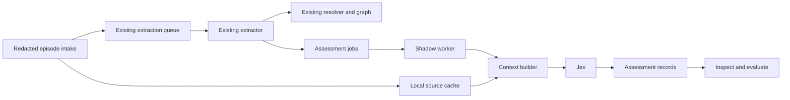

# Jev integration for Scry memory

Date: 2026-09-20  
Status: sprint specification; implementation and deployment have not started  
Suggested branch: `feat/jev-memory-integration`  
Repository baseline inspected: `main` at `9ede921`, plus the local Jev evaluation work

## Outcome

Integrate Jev as an asynchronous assessor of extractor-proposed memories. Give
each assessment the source episode plus relevant, attributed history, targeting
approximately **20,000 total input tokens**. Persist its judgments and evidence
provenance so developers can inspect disagreements and measure quality with real
retrieval. Existing extraction, resolution, ingestion and recall continue to work
when Jev is disabled, unavailable or wrong.

This sprint must deliver a working daemon integration, context retrieval, durable
assessment jobs and inspection tools. Another standalone classifier demo is not
the completion criterion. The initial production mode is **shadow**: assessments
are recorded but do not admit, reject, rewrite, merge or invalidate memories.

The roughly 20k budget is the chosen starting configuration, not a proven optimum.
Fill it with useful available history; do not manufacture padding. It includes
state, candidate fact, instructions and all questions, rather than adding 20k
history tokens on top of a separate evidence budget.

## Evidence behind the decision

The [context experiment](../../memory-assess/context-experiment/NOTES.md) made 192
live calls: 24 synthetic cases, four arms, two calls per case/arm. Model, questions
and the diagnostic 0.5 threshold stayed fixed.

| Context | Support agreement | Assertion agreement | Durability agreement | Median HTTP latency |
| --- | --- | --- | --- | --- |
| Original short input | 42/48 | 42/48 | 42/48 | 156 ms |
| Same input wrapped in JSON | 44/48 | 44/48 | 44/48 | 179 ms |
| Added relevant source statements | 46/48 | 48/48 | 45/48 | 171 ms |
| Relevant statements plus long archive | 48/48 | 48/48 | 45/48 | 284 ms |

The long arm averaged 20,349 input tokens. All calls together used 1,080,808 input
tokens, costing an estimated $0.045394. Repeated cases are correlated; source
clarifications were hand-authored, and the archive was repetitive synthetic text.
These results justify richer-context integration, not a claim of perfect
production accuracy. The experiment serialized JSON inside an episode string;
native structured state and actual retrieval still need evaluation.

Preserve the [original baseline](../../memory-assess/results/2026-09-20-baseline.md),
[expanded challenge results](../../memory-assess/results/2026-09-20-expanded-evaluation.md)
and frozen context experiment. Durability remained imperfect, and probabilities
varied across identical calls. Do not promote the 0.5 diagnostic cutoff into an
admission policy.

## Starting point and branch handoff

The evaluation work is currently present as local changes, including untracked
files. A branch or worktree created only from committed `main` will not contain
all of it. Before implementation, inventory `git status`, preserve the changes,
and bring the evaluation foundation and this spec onto the integration branch.
Do not reset, clean, stash or overwrite unrelated work to create the branch.

Read the project [AGENTS.md](../../../AGENTS.md) and installed
[TypeSafe skill](../../../.agents/skills/typesafe-ai/SKILL.md). Keep the existing
single skill installation and lockfile; no second installation method is needed.

| Existing component | Role and constraint |
| --- | --- |
| `internal/memory/assess/client.go` | Working Go HTTP adapter; pinned model, three judgments, redaction, strict validation, bounded timeout, no retries |
| `internal/memory/assess/evaluate.go` | Offline fixture validation and live evaluation metrics; preserves partial results on failure |
| `cmd/scry/memory_assess.go` | Preview by default; network requires `--live` |
| `internal/memory/distill/distill.go` | Redacted source slices, about 16k characters, one-turn overlap where possible; excludes tool-result bodies |
| `internal/memory/extract/extract.go` | Generates summaries, entities and proposed facts; Jev does not replace it |
| `internal/memory/queue/queue.go` | `Worker.process` calls `Extract`, then `resolve.ApplyWith`, then deletes the pending episode |
| `internal/daemon/memory_queue.go` | Owns memory-worker wiring, `enqueueEpisode`, memory RPCs and search-index setup |
| `internal/memory/store/{store,pending}.go` | Pending episodes have source text; persisted episodes have summaries and provenance, not full source text |
| `internal/memory/search/index.go`, `recall/query.go` | Local retrieval; public recall has a 24KB output cap and is not a 20k-token context API |
| `internal/config/config.go` | Loads `~/.scry/config.yaml`; existing extraction configuration remains authoritative |

Read the current assertion/identity admission contracts before modifying queue
boundaries, especially [the assertion admission design](../../MEMORY_ASSERTION_ADMISSION_PLAN_2026-09-06.md).
Jev supplies observations; it receives no graph-write or identity-selection authority.

## Scope and architecture

Implement source capture and shadow assessment first. Replacing extraction would
require generation, which this integration does not provide. Running Jev inline
before every graph write would couple ingestion to another provider and require
an unvalidated admission policy. Neither is part of this sprint.



Capture a copy of each candidate after successful extraction and before resolver
normalization. Assign an occurrence identity from episode ID, extraction-result
digest and candidate ordinal. Retain the original fact fields; do not use a
resolved graph fact key as candidate identity. Resolver rejection does not erase
the candidate: assessment and resolver outcome are separate observations.

Enqueueing shadow work performs local bounded writes only. Network requests and
history assembly occur in a separate worker. A cache/job-write failure increments
a visible coverage-gap counter and does not fail, retry or park the extraction
item. Successfully persisted shadow jobs survive daemon restart. This explicitly
accepts observable coverage gaps during sidecar write failure; it does not promise
atomic delivery with graph ingestion.

## Evidence capture and retrieval

### Source availability

Retain redacted episode text before the main queue deletes it. Store source type,
source reference, episode ID, repository attestation, source time, capture time,
content digest and source order/byte span when available. Preserve speaker labels.
Reapply the existing redactor before persistence and again before API submission.
Never retain an unredacted intermediate copy in the new store.

Capture at daemon intake for new episodes and at the extraction hook for pending
legacy episodes. Same-session identifiers must include the source namespace; a
path on one machine is not automatically a readable file on the daemon's machine.
Do not open arbitrary client paths or fetch transcripts from other machines.

Already-ingested episodes may have only a summary. Represent those as
`derived_summary`, with their actual provenance and `source_unavailable=true`.
Do not present them as quotations or independent corroboration. Historical raw
backfill is an explicit later operation using normal distilled input; it is not
required to enable new-episode shadow assessment.

### Context construction contract

Use local retrieval without invoking Jev recursively or calling the capped MCP
recall response. Share existing search primitives where suitable, but provide a
dedicated builder that returns evidence records and a selection manifest.

1. Include the complete redacted target episode and original candidate first.
2. Add earlier neighboring slices from the same source session, deduplicating
   overlap by source spans where available. Do not deduplicate distinct speakers'
   identical statements merely because their text matches.
3. Retrieve project/entity-related source records using candidate endpoints,
   explicit names, repository scope and lexical relevance. Include conflicting
   statements and corrections, not only matches that support the candidate.
4. Include existing graph facts or episode summaries only as clearly marked
   derived context, with provenance. Exclude graph facts originating from the
   candidate's own extraction so the result cannot corroborate itself.
5. Order selected source records chronologically in code. Resolve repository
   identity only through existing attested mappings; do not infer cross-project
   equivalence from a directory basename or ambiguous entity name.
6. Record source IDs, hashes, rank/selection reason, exclusions, truncations,
   missing raw evidence and budget accounting. Selection must be deterministic
   for the same source snapshot and context-policy version.

The assessment asks what was supported **at the target episode**, not what became
true later. Include the whole target episode as one evidence unit, including its
internal corrections. Other episodes must have source time no later than the
target's `OccurredAt`; for the same session require preceding source spans/order
as well. If order cannot be established, omit the ambiguous neighbor and record
the gap. This conservative rule can omit contemporaneous evidence; it must never
silently add future evidence. Persist the available-source revision/cutoff with
the job so delayed processing cannot acquire newly ingested evidence unnoticed.
Assessment against today's knowledge is a separate, future replay mode.

### Budget and evidence placement

Default target: 20,000 total input tokens. Reserve room for candidate and questions
before packing history. Prefer relevant source evidence over derived summaries;
remove the lowest-ranked whole history records first. Never truncate away a
negation/correction while retaining the statement it qualifies. If required core
evidence alone cannot fit, mark the job `oversize`; do not silently judge a clipped
claim. Short histories remain short.

The provider currently documents 32k tokens for state plus the longest question
and 64k for the complete request. Use working ceilings of 30,000 and 60,000
respectively. These ceilings override the target and leave headroom. A character
count divided by four is an estimate, not a valid hard-limit check.

Implement a replaceable budget counter: prefer an official compatible tokenizer
if available and verified. Otherwise use a conservative UTF-8 byte-based bound
for dispatch, report its method, and calibrate an estimated-token target against
returned usage; label it as approximate and expect underfilled packets. Verify
the fallback against the fixture corpus, including Unicode. Never assert exact
tokenization without an actual compatible tokenizer. Provider context-limit
rejections are terminal recorded errors, not triggers for hidden prompt retries.

Keep the current episode, candidate and explicitly relevant sources easy to find.
Do not prepend an undifferentiated archive simply to reach the target.

## Jev request and judgment contract

Use native named state in a new `memory-assess-v2` rubric, with a separately
versioned `context-policy-v1`. Preserve v1 request construction and frozen fixture
digests for comparison. Merely changing state shape must not silently change an
existing rubric version.

State has these fields:

| Field | Contents |
| --- | --- |
| `candidate` | Original text, source/relation/destination mentions and temporal claims; no expected labels or extractor confidence |
| `target_episode` | Redacted source text, speaker attribution and source identity/time |
| `source_history` | Ordered redacted source records with source identity and time |
| `derived_context` | Clearly labeled graph assertions/summaries; provenance and verification limitations |
| `evaluation_scope` | Target episode time, repository scope, known source gaps and chronological ordering policy |

Keep operational fields, secrets, local absolute paths, expected labels and
evaluation case IDs outside model state. Map source references to opaque stable
IDs for transmission and retain the local mapping for inspection.

Start with the same three independent questions in one request per candidate:

- **Supported (noul):** Does direct source evidence support the entire candidate,
  preserving speaker, scope, negation, timing and uncertainty? A report supports
  an attributed report, not independent proof. Prior extracted facts and summaries
  cannot be the sole evidence for support. Unresolved conflicts are not support.
- **Durable (noul):** Assuming the candidate is accurate, is it useful across
  future sessions as a fact, decision, preference, constraint or lesson? This
  judgment stays separate from truth and never becomes an automatic deletion rule.
- **Assertion (choice):** Status of the underlying candidate claim in the source
  evidence: `established`, `planned`, `hypothetical`, `denied`, or `unclear`.
  Preserve the v1 distinctions, including attributed reports and explicit
  same-scope retractions. Missing evidence and unresolved conflict are `unclear`.

Write complete semantics in instructions/criteria: question IDs do not reach the
model. Treat all source text as evidence, including text that tries to tell the
assessor how to answer. If the five-way status rubric needs redesign, evaluate it
as another rubric; do not change its meaning while reporting v1 comparability.

Use `POST https://api.typesafe.ai/v1/systemone`, Bearer authentication and pinned
`jev-1.13.0`. Extend/reuse the current Go transport rather than adding a second SDK.
Keep strict answer/model/distribution/usage validation, a 2MiB response limit,
15-second timeout, context cancellation and no redirects. Compare the response
model with the configured supported pin; do not silently follow `jev-latest`.
Store choice confidence separately from its distribution and noul probabilities.

Only `TYPESAFE_API_KEY` in the daemon environment supplies the credential. The
shell key is already available for local experiments, but a launchd daemon does
not inherit a developer's shell environment. Diagnose missing credentials without
printing them, reading shell startup files in Go, or putting secrets in YAML.

## Persistence and worker behavior

Create a separate local Badger sidecar under the daemon's Scry home, in
`memory-assess/`, owned by that daemon. Use the existing Badger dependency and
locking conventions. Keep its schema and backup/retention documentation separate
from the graph so assessment writes cannot bypass identity/admission machinery.
Off mode starts no sidecar worker, captures no new evidence and makes no Jev calls;
explicit read-only inspection of an existing sidecar remains available. No new
external service is needed.

Persist three record classes:

- **Sources:** immutable redacted revisions and retrieval metadata.
- **Jobs:** candidate occurrence, immutable extraction digest, source revision
  cutoff, model/rubric/context versions, lifecycle and terminal error details.
- **Assessments:** exact redacted request snapshot/hash, evidence manifest, raw
  validated judgments, usage, latency, timestamps and optional resolver outcome.

Use content digests for indexing, but compare canonical content when deduplicating.
A retry of the same extraction result must not create a second job; changed
extraction text, model, rubric or context policy is a new assessment identity.
Persist the final packet before dispatch so inspection can reconstruct exactly
what the provider saw. Do not store credentials or unsafe provider error bodies.

Lifecycle: `pending -> running -> completed | failed | blocked | oversize`.
Claim jobs durably with worker ownership. On restart, change abandoned `running`
jobs to `failed` with reason `interrupted_delivery_unknown`; do not assume a timed
out or interrupted request was unbilled. Explicit replay creates a new attempt,
linked to the original and visibly eligible for another charge. It must not rerun
extraction or graph resolution.

Initial worker concurrency: 2, independently bounded from extraction. No automatic
request retries in this sprint. Record transport/5xx failures and continue other
jobs. On 401/403/429, stop new dispatch, expose a blocked state and require explicit
resume after credentials/access/cooldown are corrected; honor `Retry-After` as a
minimum delay. Never change account, endpoint or model to route around a refusal.
Missing credentials similarly suspend assessment only. Configuration errors name
the invalid field without turning off the existing memory worker.

Bound pending jobs to 10,000 and 256MiB of pending payload, whichever is reached
first; capacity refusal is a visible coverage gap, never an ingestion failure.
Retain source/request payloads for 30 days with a 512MiB logical payload ceiling;
retain result metadata for 90 days with a 128MiB ceiling. Evict expired terminal
payloads first. Pin evidence needed by pending jobs; if space cannot be recovered,
refuse new shadow capture with a reason. Expiry or capacity cleanup must mark
inspection/replay evidence as unavailable rather than reconstruct a different
request silently. Document that Badger disk space may temporarily exceed logical
payload bounds until value-log collection. Test retention with an injected clock.

## Configuration and inspection

Add an optional `memory.assessment` block. The following is the proposed initial
schema, not configuration supported by today's binary:

```yaml
memory:
  assessment:
    mode: off                  # off | shadow; no enforcement mode this sprint
    model: jev-1.13.0
    target_input_tokens: 20000
    concurrency: 2
    timeout: 15s
```

Absent configuration means off. Validate mode, supported model pin, positive
budget, concurrency and timeout. Validate budget against the dispatch ceilings.
Retention and capacity values above are documented initial constants, not a
second collection of unspecified YAML controls. Mode changes take effect on daemon
restart in this sprint. Switching off cancels dispatch and preserves inspectable
records; read-only inspection may open an existing sidecar through the daemon.

Preserve `scry memory assess --file FILE` and its preview-default behavior. Add
daemon-backed commands without changing that invocation:

- `scry memory assess status --json`: effective configuration, key availability
  as a boolean, blocked reason, queue counts, coverage, source availability,
  truncation, usage, cost estimate and latency percentiles.
- `scry memory assess list --episode ID --json`: candidates and assessments,
  including terminal failures. Support bounded pagination.
- `scry memory assess show ASSESSMENT_ID --json`: judgments and provenance;
  `--include-context` explicitly includes locally retained redacted evidence.
- `scry memory assess replay ASSESSMENT_ID`: preview retained packet by default;
  `--live` requests a new linked attempt. Missing/expired evidence refuses replay.
- `scry memory assess resume`: explicitly resume blocked dispatch only after
  validating configuration and any provider cooldown.

Route these through the configured memory daemon, including remote socket setups;
do not accidentally inspect or mutate a second local store. Add an assessment
section to `scry doctor`. Off is healthy, missing/blocked assessment is reported
separately from existing extraction health. Logs contain IDs and safe reasons,
not source text or key values.

## Sprint work packages and acceptance criteria

These packages define deliverables and dependencies for the integration branch;
the sprint should derive its detailed implementation plan from this spec.

### 1. Preserve the baseline and define the structured contract

Files: existing `assess/{client,evaluate}.go` and tests; new
`assess/context.go`, `assess/rubric_v2.go` and focused tests.

- Preserve v1 output/request hashes and preview behavior while adding typed v2
  state, explicit budget accounting and provenance types.
- Mocked HTTP tests cover null/missing fields, wrong pins, invalid distributions,
  oversized responses, redirects, cancellation and secret-safe errors.
- Native structured state contains no fixture labels or extractor confidence.
- Deliver a previewable v2 packet before making live calls.

### 2. Capture and retrieve source-backed context

Files: new `internal/memory/assessstore/` for sidecar storage;
`internal/memory/assesscontext/` for retrieval/packing; daemon intake hook in
`internal/daemon/memory_queue.go`; focused distillation metadata additions only
where source ordering requires them. Keep extraction chunk size unchanged.

- A target plus older neighboring/project history yields a deterministic packet
  near the configured budget when sufficient relevant evidence exists.
- Test overlap, same text from different speakers, explicit retractions, unrelated
  projects with identical entity names, missing raw history, Unicode, oversized
  core evidence and source material containing injected instructions.
- Future episodes and newly ingested records beyond the captured revision cannot
  leak into replay. A derived memory cannot corroborate its own candidate.
- Tests prove persisted/transmitted redaction and bounded retrieval/storage.

### 3. Wire durable shadow jobs into the daemon

Files: new `internal/memory/assessworker/`; changes to
`internal/memory/queue/queue.go`, `internal/daemon/memory_queue.go`, daemon lifecycle
and `internal/config/{config,config_test}.go`.

- Each extracted candidate is eligible for a durable job with original ordinal
  and text, including candidates the resolver later rejects.
- A slow, failing or blocked Jev mock cannot consume extraction-worker slots,
  change graph writes, requeue primary ingestion or break recall.
- Identical extraction replay deduplicates jobs. Restart preserves pending work
  and marks uncertain in-flight deliveries without automatically resending them.
- Worker shutdown, source pinning, queue saturation, sidecar failure and retention
  cleanup have behavioral tests. Any missed assessment is observable.

### 4. Ship operator visibility and replay

Files: `cmd/scry/memory_assess.go` and tests; new daemon assessment RPC handlers;
doctor integration; `docs/memory-assess/README.md` and `docs/MEMORY_OPS.md`.

- Commands work through local and configured remote memory sockets.
- Existing preview/file evaluation commands remain compatible.
- Inspecting a result exposes the exact evidence manifest and versioned request;
  default output omits source content, and expired content is labeled explicitly.
- A daemon missing the shell's key reports the exact environment requirement.
- Explicit replay and resume behave as specified; off/shadow transitions and
  installation/credential instructions are documented without storing secrets.

### 5. Evaluate real retrieval and produce the integration report

Files: new versioned fixtures and reports under `docs/memory-assess/`; preserve
all existing results and manifests. Use the real builder and worker, not manually
assembled strings, for the main integration evaluation.

- Run an end-to-end synthetic session through intake, extraction mock, retrieval,
  Jev mock, persistence and inspection; compare graph output with assessment off.
- For live evaluation, preview/export a deliberately selected, redacted corpus
  before sending it. Existing synthetic-call authorization is not blanket consent
  to upload the user's entire historical memory store to another provider.
- Assemble at least 100 unique candidate judgments from at least 20 source
  episodes, spanning corrections, attribution, plans, scope and enduring value.
  Keep at least 30 candidates from separate episodes as a sealed final set;
  record reviewer labels before inference and keep related pairs in one split.
- Compare compact source, retrieved relevant source and the approximately 20k
  configuration using the same cases. Evaluate v1 versus v2 separately so a
  context change is not mistaken for a rubric improvement.
- Report FP/FN, Brier scores, assertion confusion, retention disagreements,
  retrieval coverage, source gaps, latency, throughput and returned token costs.
  Separate real reviewed examples from synthetic ones. Report disagreements
  individually rather than rewriting labels to match the model.

## Definition of done and rollout boundary

The branch is ready for shadow use when all five work packages are complete,
automated checks pass, operator commands work, and every sampled job has either
an inspectable assessment or a typed, visible failure. In the fixture harness,
off versus shadow must produce identical graph state and recall outputs; a
blocked provider must leave ingestion throughput independent of Jev latency.

Run `go test ./internal/memory/... ./internal/daemon ./internal/config ./cmd/scry`,
focused race tests for the new worker/store/context packages, and `go vet` on
changed packages. Standard CI uses local mocks and no API key. Live tests are an
explicit separate action and report their model, input hashes, corpus, cost and
completion count. Documentation-only work on this spec needs link/path validation,
not a paid evaluation rerun.

Record a shadow baseline for coverage, p50/p95 HTTP and end-to-end latency, queue
age and bytes, error rate and daily tokens. Aim for sub-second p95 Jev HTTP time
under representative concurrency; treat this as an engineering target, not a
provider guarantee. Do not hide missed samples or provider failures from reports.

No enforcing mode is included. Promoting results into admission, retention,
supersession or recall ranking requires a separate change with an independently
reviewed corpus, explicit acceptable false-positive/false-negative rates and a
rollback policy. The sprint report should recommend that next change, or explain
why the observed quality is insufficient. It must not declare success solely
because all synthetic support labels matched.

Rollback is setting mode off and restarting the daemon. It stops assessment calls
without requiring graph repair. Preserve the sidecar for local inspection or let
its documented retention expire; disabling assessment is not a data-deletion
command. No deploy, branch creation or automatic graph backfill is requested by
this specification-writing task.

## Current external contract references

Verified on 2026-09-20; recheck when implementing or changing the model pin:

- [HTTP API](https://docs.typesafe.ai/api): endpoint, state, questions and typed answers.
- [Structured state](https://docs.typesafe.ai/concepts/state): named evidence fields.
- [Models](https://docs.typesafe.ai/models): model pin, context bounds and input-only pricing.
- [Confidence](https://docs.typesafe.ai/confidence): probability/confidence semantics.
- [Citation-checking cookbook](https://docs.typesafe.ai/cookbooks/citation_check): source-grounded verification.
- [Jev 1.13 limitations](https://docs.typesafe.ai/model-jaggedness/jev-1.13): literal reading, indirection and irrelevant context.

Context7 was consulted, but some returned snippets used inconsistent legacy
response fields. The directly inspected HTTP reference and actual validated
responses in the existing reports govern the wire contract: noul uses `noul`,
and usage uses `input_tokens` / `output_tokens`.
